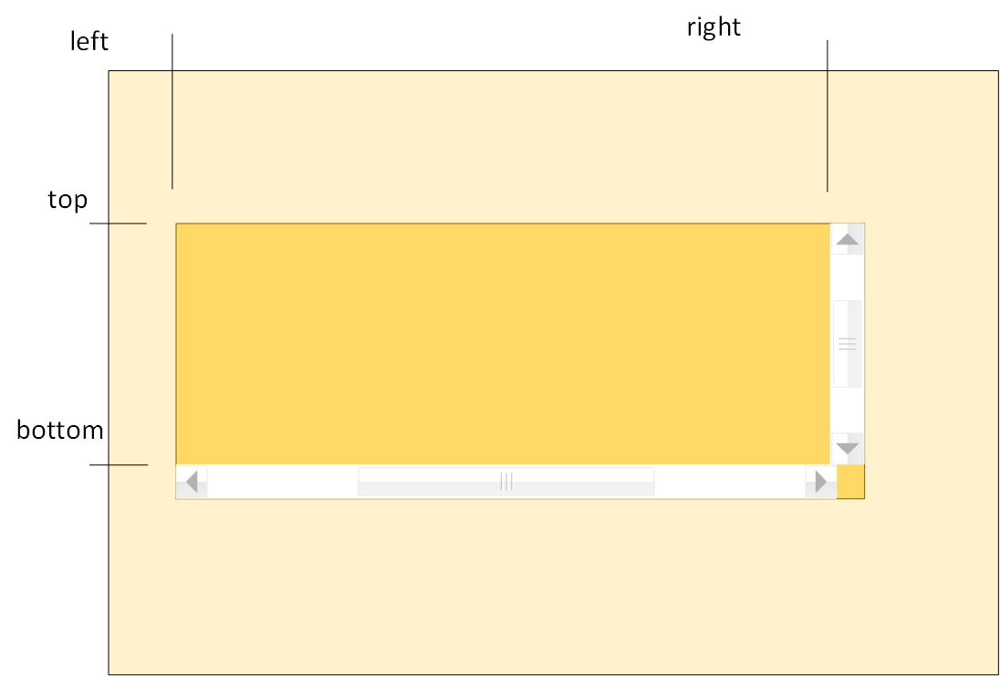

# class Element

Class Element represents DOM element and extends [Node](../Node) and so all its methods are available on element.

## Properties:

### id

string, ID of the element.

### name

string, value of attribute "name" of the element.

### tagName

string, read-only, tag of the element in upper case: "DIV", "SPAN"

### tag

string, read-only, tag of the element in lower case: "div", "span"

:::note  
Sciter specific
:::

### className

string, value of attribute "class" of the element.

### elementIndex

integer, read-only, index of this element in its parent child elements. 

:::note  
Sciter specific. Can be different from nodeIndex. 
:::

### innerHTML

string, gets or sets the HTML or XML markup contained within the element.

### outerHTML

string, gets or sets outer HTML or XML markup of the element. Setting outerHTML of the element effectively replaces it by the new element. 

### innerText

string, on gets it approximates the text the user would get if they highlighted the contents of the element with the cursor and then copied it to the clipboard. As a setter this will replace the element's children with the given value. 

### value

Can report JS value of any type. Type of the value is determined by [native behavior](../../behaviors) attached to the element. 

Returns _undefined_ if the element has no behaviors attached.

---

### firstElementChild
### lastElementChild
### nextElementSibling
### previousElementSibling

read-only, these properties report corresponding neighbour or child elements of the element. 

### childElementCount

integer, read-only, reports number of immediate child elements contained in this one. 

---
### offsetLeft, offsetTop, offsetWidth, offsetHeight

pixels, read-only. For block-level elements, offsetTop, offsetLeft, offsetWidth, and offsetHeight describe the border box of an element relative to the offsetParent.

### offsetParent

Element, readonly, a reference to the element which is the closest (nearest in the containment hierarchy) positioned ancestor element.

---

### clientLeft, clientTop

pixels, read-only, distance of element's border to the origin of scrolling area clip rectangle. Essentially that is padding box minus area taken by scrollbars.

### clientWidth, clientHeight

pixels, read-only, dimensions of scrolling area clip rectangle (padding box minus area taken by scrollbars).

---

### scrollLeft, scrollTop

pixels, scroll position of element's content. 

### scrollPosition

[Point](../../Graphics/Point), scroll position of element's content as a Point. 

### scrollWidth, scrollHeight

pixels, width and height of scrollable content of the element.

---

### style

returns reference to [Element.Style](Style) class - current styles of the element.

### state
### elementState

 - returns reference to [Element.State](State) class (Sciter.JS specific).

### classList

returns an object with following properties and methods: 

 + `element.classList.item(n)`
 + `element.classList.add(name, ...)`
 + `element.classList.remove(name, ...)`
 + `element.classList.toggle(name [,force: bool])`
 + `element.classList.contains(name)`
 + `element.classList.length`
 + `element.classList.entries()` - array, list of classes

### children

The property represents collection of child elements, it is an object:

 + `element.children[n]` - Nth child element;
 + `element.children.item(n)` - Nth child element;
 + `element.children.length: integer` - quantity of children;
 + `for(let child of element.children)` - iteration of children.

### disabled

boolean, on get returns true if element or one of its parents is disabled, on set disables the element and all its descendants. In CSS this state is reflected as `:disabled`

### readonly

boolean, on get returns true if element or one of its parents is readonly, on set declares the element and all its descendants as readonly. In CSS this state is reflected as `:readonly`.

### checked

boolean, gets/sets `:checked` state flag in CSS.

### src

string, applicable to elements that support `src` attribute (`` for example).

## Methods:

### appendChild()

```js
appendChild(node)
```

adds the node to the end of the list of children of the element, returns the node passed. 

### insertBefore()

```js
element.insertBefore(node, refNode)
```

inserts the node before a reference node as a child of the element, returns the node.

### insertAfter()

```js
element.insertAfter(node, refNode)
```

inserts a node after a reference node as a child of the element, returns the node.

### insertAdjacentHTML()

```js
element.insertAdjacentHTML(where, html)
```

See [insertAdjacentHTML](https://developer.mozilla.org/en-US/docs/Web/API/Element/insertAdjacentHTML).

### removeChild()

```js
element.removeChild(node) : node
```

removes a child node from the DOM and returns that removed node.

### replaceChild()

```js
element.replaceChild(newNode,oldNode)
```

replaces the oldNode by the newNode.

### replaceChildren()

```js
element.replaceChildren([node1[, node2, ...]])
```
Clears the element and adds nodes (if any).

### swapWith()

```js
element.swapWith(otherElement)
```

Swap DOM locations of this element and _otherElement_. 
Elements should be compatible - it is not possible to swap `<td>` and `<li>` for example.

---

### childElement()

```js
element.childElement(n) : element | null
```

returns n-th child element; n is in [0, element.childElementCount) range. 

---

### querySelector()
### $()

```js
const el = container.$(selector);
````
parameters:
- *selector* - string, CSS selector of descendent element.

returns: 
- first contained element that matches the selector;

:::tip
Start selector with `>` or `:root>` to match immediate child element:
```js
const opt2 = select.$(">option[value='2']");
```
:::

:::tip
The _selector_ may include multiple groups separated by `,`:
```js
const firstHeader = section.$("h1,h2");
```
:::


### querySelectorAll()
### $$()

```js
const children = container.$$(selector);
````
parameters:
- *selector* - string, CSS selector of descendent element.

returns: 
- array of elements that match the selector;

:::tip
Use for/of to enumerate all matching elements:

```js
for(const option of select.$$("option"))
  console.log(option);
```
:::


### closest()
### $p()

```js
const parent = element.$p(selector)
```

returns an element which is the closest ancestor of the current element (or the current element itself) which matches the selectors given in parameter.

### $o()

```js
const owner = this.$o(selector)
```

owner element selector, useful to get owner of menus and popups.

### matches()
### $is()

```js
if(this.$is("option:expanded"))
  ...
```
Returns a boolean value indicating whether or not the element would be selected by the specified selector string.


### getElementsByClassName()
 
```js
element.getElementsByClassName(names)
```

parameters:
- *names*, string, one or space-separated list of class names;

returns:
- list (array) of elements which are descendants of this element with the given class name(s).


### getElementsByTagName()
 
```js
element.getElementsByTagName(tagName)
```

parameters:
- *tagName*, string, tag name;

returns:
- list (array) of elements which are descendants of this element with the given tag.


### getElementsByName()
 
```js
element.getElementsByName(name)
```

parameters:
- *name*, string, value of name attribute;

returns:
- list (array) of elements which are descendants of this element with the given name.

---

### hasAttribute()

```js
element.hasAttribute(name)
```
parameters:
- *name*, string - name of an attribute;
returns 
- *true* if an attribute with the given name exists;

### getAttribute()

```js
element.getAttribute(name)
```
parameters:
- *name*, string - name of an attribute;
returns 
- *string* value of an attribute;
- *null* if the given attribute does not exist;

### getAttributeNames()

```js
element.getAttributeNames()
```
returns array of strings - names of attributes declared on the element;

### removeAttribute()

```js
element.removeAttribute(name)
```
parameters:
- *name*, string - name of an attribute;

### setAttribute()

```js
element.setAttribute(attribute, value)
```
parameters:
- *name*, string - name of an attribute;
- *value*, string - value of an attribute;

---
### getBoundingClientRect()

```js
element.getBoundingClientRect(): Rect
```

returns [Rect](../../Graphics/Rect) - border box of an element. Position of the rectangle is relative to the viewport of the document.

---

### scrollTo()
 
```js
element.scrollTo(x,y)
````
sets scroll position of scrollable element.

```js
element.scrollTo(options)
````

  sets scroll position of scrollable. _options_ is an object with the fields:

  * `position` - Point, scroll position as point, or
  * `left` - x scroll position, if _position_ is not defined,
  * `top` - y scroll position, if _position_ is not defined;
  * `behavior` : `"instant"` | `"smooth"`, if _smooth_ performs animated scroll;

### scrollIntoView()

scrolls this element into scrollable view - makes it visible - not occluded.

```js
element.scrollIntoView([toTop:true]);
````
or 

```js
element.scrollIntoView(options);
```

where _options_ is an object with fields:

* `behavior` : `"instant"` | `"smooth"` - if _smooth_ performs animated scroll;
* `block` : `"start"` | `"nearest"` - defines vertical position;

---

### elementFromPoint()

```js
elementFromPoint(x,y):Element
```
returns:
- sub-element inside this element found at coordinates x/y. x/y coordinate are relative to lef/top of element's inner box;
- *null* if no sub-element is found. 


---

### click()

```js
element.click()
```

generates click event on the element. 

### focus()

```js
element.focus()
```
sets input focus to the element

---

### addEventListener()

```js
addEventListener(type, listener[, options])
```

parameters:
- *type*, string, event name;
- *listener*, either 
  + `function(event)` - function to be called on event, or
  + object with `handleEvent(event)` method;
- *options*, optional object with the following properties:
  + *capture*, boolean, if *true* then the event handler is subcribed to the event in capturing (a.k.a. sinking) phase;
  + *once*, boolean, if *true* then the event handler will called only once - automat  

### removeEventListener()

```js
removeEventListener(type, listener)
```

removes event *type* *listener* from the element.  


### dispatchEvent()

```js
element.dispatchEvent(event)
```

invokes event handlers synchronously on the element. All applicable event handlers are called and return before dispatchEvent() returns.


### postEvent()

invokes event handlers asynchronously on the element. The function enqueues the event into message queue and returns immediately.

:::tip
sciter specific, asynchronous version of .dispatchEvent()
:::


---

## Methods (Sciter specific):


### on()

```js
element.on(eventname: string, [selector: string,] handler: function): Element
```

jQuery style event subscription, parameters:

- *eventname* - string, name of event that 
  + may start with `^` for handling events in capturing phase;
  * may contain namespace part: `"click.myns"`;
- *selector* - string, optional, CSS selector of target element; 
- *handler* - function(evt,target), event handling function that:
  + is called with `this` set to element the element this handler is attached to;
  + is called with two parameters `handler(evt,matchedElement)` - event and the element matching the *selector* if it was given;

returns:
- the element itself allowing to chain `on` calls;


### off()

```js
 element.off(eventname): Element
```
Unsubscribe event handlers either by name  `"click"` or by namespace `".myns"`.

```js
 element.off(handler: function): Element
```
Unsubscribe event handlers by function reference.

### once()

```js
element.once(eventname: string, [selector: string,] handler: function): Element
```
Same as `element.on()` but calls `element.off(handler)` after handling the event once.

---

### onGlobalEvent()

```js
element.onGlobalEvent(eventname: string, handler: function): Element
```

event subscription to application wide events (a.k.a. "global events"):

parameters:  
- *eventname*, string, arbitrary event name, may contain namespace part: `"click.myns"`;
- *handler*, function,
  * the handler is called with `this` set to the element;
returns
- element itself allowing to chain `onGlobalEvent` calls.

:::tip
The element gets unsubscribed automatically when it gets disconnected from the DOM. 
:::

Global events can be sent or posted by static [Window.send(event)](../Window#Window-send) and [Window.post(event)](../Window#Window-post) and are delivered to all subscribers in all windows of the application.


### offGlobalEvent()

```js
element.offGlobalEvent(eventname: string): Element
```
Unsubscribe event handler by event name (like `"click"`) or by namespace (like `".myns"`).

```js
element.offGlobalEvent(handler: function): Element
```
Unsubscribe event handler by its reference.

```js
element.offGlobalEvent(): Element
```
Unsubscribe all global event handlers from the element.

---

### timer()

```js
element.timer(milliseconds, callback: function)
```
  
Starts timer on element. If the element already has timer with that callback it first gets removed and new timer started instead. This allows to implement effective throttling. If the *callback* function returns `true` value then the timer will keep ticking (like interval timer). The callback is called with `this` set to the element.

### post()

```js
element.post(function [, avoidDuplicates: true | false])
```
Posts the function for later execution. The functions will be executed in the next event loop iteration.

`element.post(function)` conceptually is equivalent to `setTimeout(function,0)` but with two differences:  
1. The function will be called with `this` set to the element;
2. If _avoidDuplicates_ is _true_ (default value) `element.post` checks input queue before sending and if input queue already contains that element/function pair the function will be called only once. 

```js
element.post(event [, avoidDuplicates: true | false] )
```

Posts the instance of [Event](../Event) to the event queue.  `element.post(event)` is an equivalent to [postEvent()](#postEvent).

---

### clear()

```js
element.clear()
```

Removes content of the element - makes it empty.

### unwrapElement()

```js
element.unwrapElement()
```

Removes the element itself and moves its content into its place in the DOM. So after calling `div.unwrapElement()` here:
```html
<body>
  <div>Hello <b>world</b></div> 
</body>
```
it will become
```html
<body>
  Hello <b>world</b>
</body>
```

### wrapNodes()

```js
element.wrapNodes(start:Node,end:Node,wrap:Element)
```

Wraps range of nodes from _start_ to _end_ into _wrap_ element - opposite acction to `unwrapElement()`.

---

### checkCommand()
### executeCommand()

```js
element.checkCommand(command [, params]): flags;
element.executeCommand(command [, params]): flags
```
Support of editable input elements: `<htmlarea>` (WYSIWYG editor), `<plaintext>` (multiline text editor), `<textarea>` and `<input|text>`. 

parameters:
- _command_, string, name of editing operation;
- _params_, optional parameters of the operation;  
returns:
- integer, ORed flags of command availability:
  + `0` - command is supported at current state and caret position;
  + `0x01` - command was applied at current state and caret position;
  + `0x02` - command is disabled, not supported at current state and caret position;

Examples:
```js
if(htmlarea.checkCommand("edit:paste") == 0)
  // a) clipboard contains pasteable content and 
  // b) it can be pasted at current caret position 
```

```js
htmlarea.execCommand("edit:insert-html", html);
```
Insert the _html_ at current caret position. The insert operation is undoable by the user.

TBD...

---

### xcall()

```js
element.xcall(name:string [, arg0, ..., argN]): any
```

Interaction with native behaviors attached to the element. 

`element.xcall("foo")` will end up in [`handle_scripting_call()`](https://gitlab.com/sciter-engine/sciter-js-sdk/-/blob/main/include/sciter-x-behavior.h#L761) of native behavior attached to the element.

---

### paintBackground {#paintXXXX}
### paintContent
### paintForeground
### paintOutline

```js
element.paintBackground = function(graphics) {...} 
element.paintContent = function(graphics) {...}
element.paintForeground = function(graphics) {...}
element.paintOutline = function(graphics) {...}
```

Immediate mode drawing support. 

Functions assigned to these "port" properties will be called when the element is rendered on screen so they can draw anything on top (or below) of default HTML/CSS rendering. These functions receive current [Graphics](../../Graphics) object that is used to paint the rest of the DOM.

```js
element.requestPaint();
```

Invalidates element painting area - schedules re-paint of the element. This will trigger `element.paintXXXX` later calls (if any). On Windows this will end up in [InvalidateRect](https://docs.microsoft.com/en-us/windows/win32/api/winuser/nf-winuser-invalidaterect) call.

### flushPaint()

```js
element.flushPaint();
```

Forces immediate paint of element's window. Synchronous, blocking function - it will return after window surface will be updated.

:::caution
Use this method with care and only when you really need it, e.g. when you need to update screen before blocking operation:
:::
Example: 
```js
  progressEl.value = progress;
  progressEl.flushPaint();
  progress = someBlockingOperation();
```

---

### popup()

```js
element.popup(popup:Element | JSX, params : Object )
```

Shows the _popup_ element or VNode (JSX) in out-of-canvas popup window on desktop. Params is an object that may have following fields:

+ _anchorAt_ - 1..9, reference point on anchor border box (see keyboard NUMPAD for the meaning);
+ _popupAt_ - 1..9, reference point on popup's _margin_ box; 
+ _x_, _y_ - optional, explicit window coordinates of _popupAt_ point.
+ _animationType_ - optional, one of "blend" | "inflate" | "slide" | "roll" - type of window appearance animation;
+ _animationAxis_ - optional, one of "horizontal" | "vertical" ;
+ _animationHeading_ - optional, one of "start-to-end" | "end-to-start";
+ _animationDuration_ - [duration](../../JS/units/Duration) of the animation;

Engine will try to replace popup (element inside window) so _popupAt_ position is at _anchorAt_ on screen.

:::tip
popup positioning can be defined in CSS by [popup-position](../../CSS/properties#popupposition). In this case _params_ can be ommited.
::: 

:::tip
popup animation can be defined in CSS by [popup-animation](../../CSS/properties#popupanimation). 
::: 


### takeOff()

```js
element.takeOff(params:object)
element.takeOff()
```

Make the element "airborn" - to be replaced outside of host window, *params* are:

- `params.x`,`params.y` - numeric, element coordinates, *screen* pixels - new position of DOM element;
- `params.width`,`params.height`  - optional, numeric, new dimensions in *screen* pixels;
- `relativeTo` - string, defines meaning of *x* and *y*, one of:   "screen","document","window","parent" or "self"
- `window` - string, defines type of window that will host the element, one of: 
  + "attached" - attached window, will move in sync with the host window; 
  + "detached" - detached window, position will be independent from the host window;
  + "popup" - same as "detached" window, put also will be placed as topmost - on top of other windows on desktop.

takeOff() call without parameters lands the element back - brings it to its normal position it was before it was taken off. 

---

### replaceContent()

```js
element.replaceContent(newContent:JSX[,params:object]) : Promise | undefined;
```

Changes content of the element with various animation effects.

_params_ here is an object that may contain following fields:

  * `params.duration` - integer, milliseconds - duration of the animation, optional, 200ms if not provided;
  * `params.ease` - string, name of ease function, optional, "linear" is used by default;
  
    #### animate ease functions: {#animate-ease}
    
    * "linear",
    * "ease","ease-in","ease-in-out","ease-out",
    * "quad-in","quad-out","quad-in-out",
    * "cubic-in","cubic-out","cubic-in-out",
    * "quart-in","quart-out","quart-in-out",
    * "quint-in","quint-out","quint-in-out",
    * "sine-in","sine-out","sine-in-out",
    * "expo-in","expo-out","expo-in-out",
    * "circ-in","circ-out","circ-in-out",
    * "elastic-in","elastic-out","elastic-in-out",
    * "back-in","back-out","back-in-out",
    * "x-back-in","x-back-out","x-back-in-out",
    * "xx-back-in","xx-back-out","xx-back-in-out",
    * "bounce-in","bounce-out","bounce-in-out";

  * `params.effect` - string, name of transition effect method, optional, "blend" by default, one of: 
    * "blend",
    * "blend-atop",
    * "slide-top",
    * "slide-bottom",
    * "slide-left",
    * "slide-right",
    * "slide-over-top",
    * "slide-over-bottom",
    * "slide-over-left",
    * "slide-over-right",
    * "remove-top",
    * "remove-bottom",
    * "remove-left",
    * "remove-right",
    * "scroll-top",
    * "scroll-bottom",
    * "scroll-left",
    * "scroll-right"

If _params_ object is ommited then the function does instant replacement, equivalent of `element.patch(JSX,true/*only-children*/)`.

:::tip
If _params_ object is provided then the function returns `await`'able promise that gets resolved at the end of animation. 
:::

### morphContent()

```js
element.morphContent(step:function,params:object)
```

The method offers "manual" animation support. The _step_ function has following signature 
`function step(progress:0.0 ... 1.0): true | false`

Sciter will call step function with animation frame rate passing current progress value. If the function returns *false* animation stops.

*params* may contain following fields:

+ `params.duration` - integer, optional, milliseconds - duration of the animation;
+ `params.ease` - string, optional, name of ease function, see [params.ease](#animate-ease) above. This parameter determines curvature of *progress* values. 

---

### append()

```js
element.append( JSX )
```
appends element defined by JSX expression (vnode) as the last child:
  
```js
  list.append(<li>yet another item</li>);
```

### prepend()

```js
element.prepend( JSX )
```
insert the element as the first child

### content()

```js
element.content(JSX)
```
replaces element content by the JSX expression (VNode):

```js
  div.content(<>Per aspera ad <b>astra</b>!</>);
```

### patch()

```js
element.patch( JSX [, onlyChildren:true] )
```

patches content of the element by JSX (vnode) using rules of React[or]. If second parameter is provided and is _true_ the function patches only children but not element itself.

This is a core function of native implementation of React[or]. 

### componentUpdate()

```js
element.componentUpdate( [obj] )
```
patces properties and enqueues rendering if _obj_ properties are different, does roughly the following:  

```js
if(Object.assignIf(element,obj))    // 1. merge properties and if they are different
  element.post( (element) => {     // 2. enqueue update
    let vnode = element.render();  // 3. calls .render() that must return vnode (JSX expression)
    element.patch(vnode);          // 4. reconciliation / patching
  });
```
If _obj_ is ommited then the method performs uncoditional update: 
```js
 this.patch(this.render())
``` 

### rangeFromPoint()

```js
element.rangeFromPoint(x,y) : Range | null
```

Returns collapsed [range](../Node/Range) (caret position) at point x/y. x/a are local coordinates - relative to origin of element's inner box.   

### toString()

```js
element.toString() : string
```

Returns short string representation of the element. Used mostly for debug purposes.

### box()

```js
element.box(boxType[,relativeTo[,asPpx]]) : Rect
```

parameters:

- _boxType_ , string, defines particular metric of the element:

  * "inner" - inner box of the element in terms of CSS box model;
  * "border" - border box of the element;
  * "padding" - padding box of the element;
  * "margin" - margin box of the element;
  * "client" - client box of the element - scrollable clip area of the element, usually that is padding box minus scrollbars;
  * "content" - content outline of the element. For scrollable elements that is size of scrollable content;
  * "caret" - caret postion (if any);
  * "icon" - position of *foreground* image (CSS) on the element;
  * "scroll" - projection of *client* rect on content box of the element:
     

- _relativeTo_, string. defines offset of x/y values of returned box, one of:

  * *element* - reference to other element, coordinates are relative to the _element_;
  * "screen" - relative to screen - absolute coordinates of the element on screen (desktop);
  * "window" - relative to client area of the window;
  * "document" - relative to root element - document;
  * "parent" - relative to DOM parent of the element;
  * "container" - relative to layout container - for position'ed elements this tells position relative to nearest positioned container;
  * "self" - default, relative to the element itself, "inner" x/y are 0 in this case;

- _asPpx_, boolean, if defined and is _true_ tells the function to return coordinates in screen pixels. By default the function returns logical CSS pixels a.k.a. DIPs - logical units, 1/96 of inch.

returns:
- [Graphics.Rect](../../Graphics/Rect) object. 

### create()

Static, class method, constructor of Element instances:
```js
Element.create(JSX | tag:string) : Element
```
returns an element constructed either from JSX expression (vnode) or by tag name. In later case it behaves exactly as `document.createElement(tag)`.
