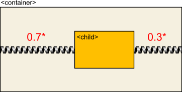
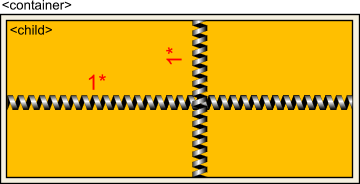
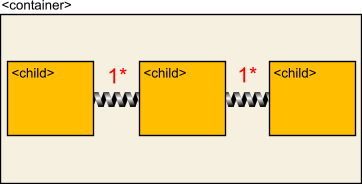
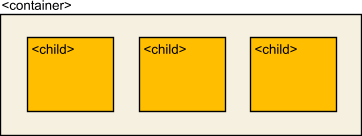
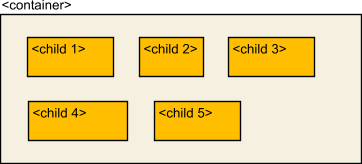
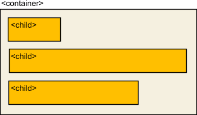
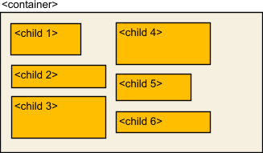
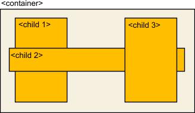
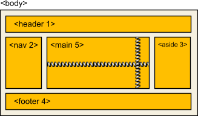
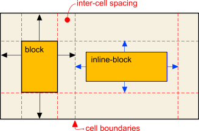

# Flows and Flexes

Layout responsivness in Sciter is based on two simple concepts:

* **flex units** - `0.5*`, `1*`, `2*` or just `*` (equivalent of `1*`);
* the **flow** property - declaration of layout manager used inside the element;

The flow/flexes is Sciter's equivalent of both `display:flexbox` and `display:grid` in W3C CSS.

See [Flexes vs Flexbox](demo/flow-vs-flexbox.htm) cheat sheet for the comparison.

## Flex inits

The flex unit ( width:1* or just width:* ) can be applied to pretty much any existing CSS property : 
* width/height, 
* margins, 
* paddings, 
* border-width,

and has very clear physical model – it is a strength of a coil attached to the particular side/part of the element.

### Examples

#### Flexible Margins

These rules will shift a *child* horizontally inside a *container* with left(0.7)/right(0.3) ratio:
```css
container {
  display: block;
  width:360px;
  height:170px;
}
child {
  display: block;
  width:120px;
  height:70px;
  margin-left: 0.7*; /* coil of strength 0.7  */
  margin-right: 0.3*; /* coil of strength 0.3  */
}
```


:::note
Flex units distribute **free space** left in a container **after** applying _length_ and _%_ units to content. In this case fixed child dimensions are less than dimensions of a container making free space we can distribute according to flexes in corresponding directions. 
:::

#### Flexible Dimensions

These rules will instruct a *child* to fill a *container*'s free inner area in full:
```css
container {
  display: block;
  width:360px;
  height:170px;
}
child {
  display: block;
  width: 1*; /* coil of strength 1  */
  height: 1*; /* coil of strength 1 */
  size:*; /* or simply use this instead of those 2 above */
}
```


#### Flexible Border Spacing

These rules will instruct children to be spread inside a *container*'s with equal spacing:
```css
container {
  display: block;
  width:360px;
  height:170px;
  flow: horizontal; /* children in a row */
  border-spacing: 1*; /* springs between children */
}
child {
  display: block;
  width: 87px; 
}
```


## Flow

The _flow_ property defines layout manager used to replace children of a container. It accepts the following values:

* `default` - discover flow by content automatically;
* `horizontal` - single row;
* `horizontal-wrap` - "brick work" in rows;
* `vertical` - vertical column, close to default block flow in browsers;
* `vertical-wrap` - "brick work" in columns;
* `stack` - one child on top of another, simpler and faster alternative to position:absolute; 
* `grid()` - explicit grid layout;
* `row()` - grid layout but automatic row fills;
* `text` - text only layout, like default `<p>`;

### flow:horizontal

Children are replaced in single row:



```css
container {
  display: block;
  width:360px;
  height:170px;
  flow: horizontal; /* children in a row */
  padding: 30px;
  border-spacing: 30px; /*distance between children*/
}
child {
  display: block;
  width:*; /* children are of the same width,
              if that is needed */
}
```

:::note
If defined, left and right margins of children are collapsing in the same way as top/bottom margins in default block (vertical) layout
:::

:::tip
Define `child { height:* }` if you want children to fill vertical space of a container in full.
:::

:::tip
`vertical-align` and `horizontal-align` on a container can be applied to align children if they are not using flexes.
:::


### flow:horizontal-wrap

Children are replaced in multiple rows, if they do not fit in one row:



```css
container {
  display: block;
  width:360px;
  height:auto;
  flow: horizontal-wrap; /* children are in rows */
  padding: 30px;
  border-spacing: 30px; /*distance between children*/
}
child {
  display: block;
  width:XXX; /* children have variable width */
}
```

:::tip
Define `child { height:* }` if you want any of children to fill vertical space of a **row** in full.
:::

:::tip
Rows can be break explicitly by defining `child { clear:after }` or `child { clear:before }`.
:::


### flow:vertical

Children are replaced in single column:



```css
container {
  display: block;
  width:360px;
  height:auto;
  flow: vertical; /* children in single column */
  padding: 15px;
  border-spacing: 15px; /*distance between children*/
}
child {
  display: block;
  width:*; /* to span whole width of a container if needed */
  height: auto;
}
```

:::note
If defined, top and bottom margins of children are collapsing.
:::

:::tip
Define `child { height:* }` if you want some child to fill vertical space left in a container.
:::

## flow:vertical-wrap

Children are replaced in multiple columns if they do not fit in one column:



```css
container {
  display: block;
  width:360px;
  height:auto;
  flow: horizontal-wrap; /* children are in rows */
  padding: 30px;
  border-spacing: 30px; /*distance between children*/
}
child {
  display: block;
  width:XXX; /* children have variable width */
}
```

:::tip
Define `child { height:* }` if you want any of children to fill vertical space of a **column** in full.
:::

:::tip
Define `child { clear:after | before }` if you want to force column break.
:::

There are two distinct sub-modes of vertical layout that are triggered by `overflow-x: auto | scroll | scroll-indicator`:

### horizontal grow

```css
div {
  flow: vertical-wrap;
  overflow-x: scroll-indicator; /* or auto or scroll */
}
```

In this mode columns are added to the right, creating horizontal scrollbar if needed.

### vertical grow

```css
div {
  flow: vertical-wrap;
  overflow-y: scroll-indicator; /* or auto or scroll */
}
```

In this mode items are making columns taller, creating vertical scrollbar if needed.

### flow:stack

Children are replaced on top of one another.



Conceptually this layout mode is close to `position:relative` / `position:absolute` "manual" layouts but:

1. is more lightweight - does not create separate rendering tree layers;
2. is managed as any other static layout elements;
3. allows to use flex units for responsive positioning. 

```css
container {
  display: block;
  width:*;
  height:*;
  flow: stack; 
  padding: 30px;
}
child:nth-child(1) {
  display: block;
  height:*; /* spans whole height */
  width:60px; 
  margin:0 * 0 20px; 
}
```
:::tip
Precise child position and alignment can be done by defining its `margin`s. 
:::
:::tip
Children can be visually reordered by defining their z-index. 
:::

## flow:grid()

The grid flow allows to replace elements as grid cells using "ascii template". Cells can span multiple rows and columns.

Famous "Holy Grail" layout:

```html title="html"
<body>
  <header>...</header>
  <nav>on the left</nav>
  <aside>on the right</aside>
  <footer>...</footer>
  <main>middle</main>  
</body>
```

```css title="css"
body {
  flow: grid( 1 1 1,
              2 5 3,
              4 4 4);
}

body > main {
  size:*; /* spans all available space,
             shifting other elements to borders */
}
```



This CSS declartion defines 3x3 grid with elements 1 (header) and 4 (footer) spanning whole rows.

### Template definition rules

1. The grid function accepts row definitions separated by `,` commas.
2. Each row contains space separated element indexes.
3. If the cell spans multiple rows and/or columns its index is placed in spanned locations.
4. Cell spans shall constitute rectangular sections.
5. Empty, non-occupied positions can be marked by `*`.

### Grid cells and spacing

* `display:block` elements span whole cell box. Margins on elements constitute inter cell space.
* `display:inline-block` elements are replaced inside cell box, margins on such elements define spacing of this element from cell box.



Inter cell spacings are defined either

1. by `margin`s on `display:block` elements, and/or 
2. by `border-spacing` property of `flow:grid()` container, whatever is larger.

### flow-rows and flow-columns

`flow-rows` and `flow-columns` CSS properties allow to define rows and columns explicitly:

```css
flow-rows: <rc-metric> <rc-metric> ...;
flow-columns: <rc-metric> <rc-metric> ...;
```
each property accepts whitespace separated list of _\<rc-metric\>_ definitions, where each _\<rc-metric\>_ is one of:

* _length_ unit, like `100px`;
* _flex_ unit, like `*`;
* _min-content_ or _max-content_ literals;
* _minmax(min,max)_ function, like `minmax(100px,200px)`
* _repeat(N,\<rc-metric\>)_ function, like `repeat(3,300px)` 


## flow:row()

The _row()_ flow is a variant of a _grid()_ flow and is different only by method of grid content defintion.

```css
flow: row(<col-content>,<col-content>, ...<col-content>);
```
Arguments of the row is comma separated list of _\<col-content\>_ defintions that define elements that will go in that column.

Each _\<col-content\>_ in its turn is whitespace separated list of HTML tags of elements that fall into that column:

```html title="html"
<form>
  <label>first name</label> 
    <input|text(first-name) />
  <label>second name</label> 
    <input|text(second-name) />
  <label>gender</label> 
    <select(gender)>
      <option>male</option>
      <option>female</option>
    </select>
</form>
```
```css title="css"
form {
  /* first column - only <label>
     second column - either <input> or <select>*/
  flow:row(label, input select); 
  flow-columns: max-content *;
}
```

:::tip
An element that is not listed in a row template is treated as a full-row element - it spans all columns.
:::