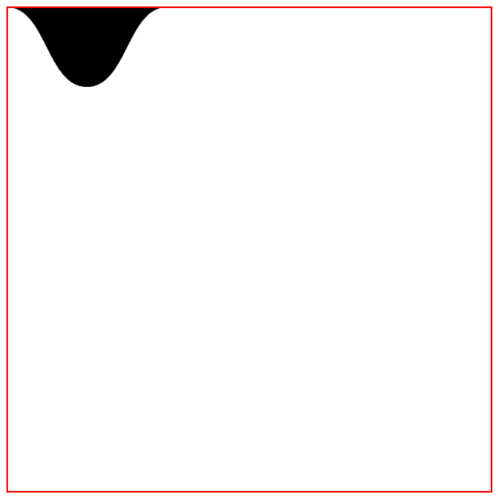

# Vector Images, icon() and path()

Pretty much all UI designers time to time experience need of drawing of non-trivial shapes directly in CSS - icons, non-rectangular elements and their backgrounds.

Lack of such feature leads to appearance of far from being optimal solutions: icon fonts (like font-awesome), crazy attempts to draw non-trivial shapes using CSS border artifacts and excessive use of additional pseudo-elements: `::after` and `::before`. People are wasting time writing tons of essays on the subject, see [how far](https://css-tricks.com/the-shapes-of-css/) it can go... 

## Vector images

Consider this SVG element:

```svg
<path d="c 50,0 50,100 100,100 c 50,0 50,-100 100,-100" fill="#000" />
```
Note that `d` attribute value. It defines a path with pretty simple yet powerful format. But just to draw that simple curve SVG requires bunch of DOM elements to be created around it. Not so lightweight for that simple purpose.

Instead of SVG use for such simple purposes Sciter's CSS offers `path()` and `icon()` functions and URL schemas.

```css
div {
  background-image: url(path:c 50,0 50,100 100,100 c 50,0 50,-100 100,-100);
  background-repeat: no-repeat;
}
```
And here is what I did in Sciter, it now supports so called paths and path urls that use exactly that svg's [d-path](https://developer.mozilla.org/en-US/docs/Web/SVG/Attribute/d) format:

## path() images and urls

```css
div {
  size:300px;
  border:1px solid red;
  background-image: path(c 50,0 50,100 100, 100 c 50,0 50,-100 100,-100);
  background-repeat: no-repeat;
  fill:#000;
}
```
that above will be rendered as:



The path() can be used in places where URL is expected but with `path:` URL schema.

```html

```
That image above, with this style:
```css
img {
    border:1px dotted;
    fill:gold;
    stroke:red;
    stroke-width: 3px;
}

```
will be rendered as 


## icon() images and urls

The icon() vector images is a variant of the path() but with two variants:

### Stock icons

Sciter contains internal library of stock vector images used in decoration of built-in components.

Such stock imagese are accessible as `icon(name)` "functions" and as URLs `icon:name`. Here is an image of right pointing chevron:

```html
  
```

All stock icon names are listed in usciter app from Sciter SDK:


### Custom icons

Application also can define icons on their side using `icon(` _vbox_ `;` _d-path_ `)`  construct, where:

* _vbox_ is a string that contains 4 numbers = the position and dimension, in user space, of an [SVG] viewport - same as svg::viewbox.
* _d-path_ - path commands of [_d_ attribute in SVG](https://developer.mozilla.org/en-US/docs/Web/SVG/Attribute/d).

Therefore if we have source SVG like this:

```svg
<svg viewBox="0 0 100 100" xmlns="http://www.w3.org/2000/svg">
  <path
    fill="none"
    stroke="red"
    d="M 10,30
       A 20,20 0,0,1 50,30
       A 20,20 0,0,1 90,30
       Q 90,60 50,90
       Q 10,60 10,30 z" />
</svg>
```

then its CSS icon equivalent will be 

```css
icon.heart {
  foreground-image: icon(0 0 100 100;M 10,30 A 20,20 0,0,1 50,30 A 20,20 0,0,1 90,30 Q 90,60 50,90 Q 10,60 10,30 z );
  foreground-repeat: no-repeat;
  foreground-size: contain;
  fill:none;
  stroke:red;
  stroke-width:1px;
}
```

that will be rendered as:


## Public collections of icons

### Google Fonts

[Google Fonts](https://fonts.google.com/icons?icon.platform=web) contains excessive set of icons. Individual icons there can be exported / saved as SVGs with different options, ready to be converted to such vector images:


## Bonus: expandable vector images

TBD